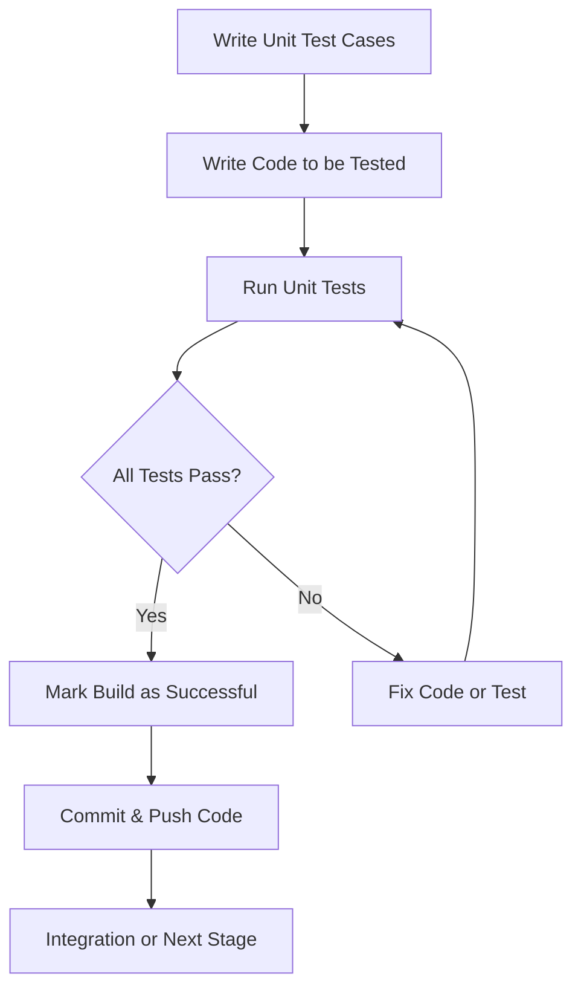

# Java CI Checks: Unit Testing

## Author Information

| Created by      | Created on         | Version          | Last updated On   | pre Reviewer       | L0 Reviewer     | L1 Reviewer          |    L2 Reviewer    |
|-----------------|--------------------|------------------|-------------------|--------------------|-----------------|----------------------|-------------------|
| Abhishek saini  |  12-08-2025        | V 1.0            |    |  Prashant          |  -      |      -  |  - |

---

## Table of Contents

- [Introduction](#introduction)
- [What is Unit Testing](#what-is-unit-testing)
- [Why is Unit Testing Important](#why-is-unit-testing-important)
- [Workflow Diagram](#workflow-diagram)
- [Different Tools for Unit Testing in Java](#different-tools-for-unit-testing-in-java)
- [Tool Comparison](#tool-comparison)
- [Advantages of Unit Testing](#advantages-of-unit-testing)
- [Proof of Concept (POC)](#proof-of-concept-poc)
- [Best Practices](#best-practices)
- [Conclusion](#conclusion)
- [Contact Information](#contact-information)
- [References](#references)

---

## Introduction
Unit testing is a critical practice in software development that involves testing individual units or components of an application in isolation. In Java, unit testing helps validate that each method or class performs as expected before the code is integrated into the larger system.

---

## What is Unit Testing

In Java, common unit testing frameworks include JUnit and TestNG. These frameworks allow you to create tests that are automatically executed as part of the CI pipeline, ensuring that any code changes still meet quality standards.

---

## Why is Unit Testing Important

| **Reason**                   | **Explanation**                                                                                  |
|------------------------------|--------------------------------------------------------------------------------------------------|
| **Prevents Regressions**      | Running unit tests as part of a CI pipeline ensures that new changes don’t break existing code.   |
| **Early Bug Detection**       | Bugs are detected early in the development process, reducing the cost of fixing them later.       |
| **Code Quality**              | Unit tests enforce a structured and well-tested codebase.                                         |
## Workflow Diagram

---

## Different Tools for Unit Testing in Java
| Tool                      | Description                                       | Key Features                               |
| ------------------------- | ------------------------------------------------- | ------------------------------------------ |
| **JUnit**                 | Most widely used testing framework for Java       | Annotations, assertions, runners           |
| **TestNG**                | Inspired by JUnit, supports more flexible tests   | Parallel testing, data-driven tests        |
| **JaCoCo**                | Java Code Coverage Library                        | Measures test coverage, integrates with CI |
| **Maven Surefire Plugin** | Runs unit tests in Maven build lifecycle          | Integration with Maven builds              |
| **Gradle Test Task**      | Runs unit tests during Gradle builds              | Flexible test configuration                |
| **SonarQube**             | Code quality and coverage analysis                | Integration with CI for reports            |

---

## Tool Comparison
| Feature / Tool         | JUnit                | TestNG                        | JaCoCo                  | Gradle Test Task          | SonarQube                         |
| ---------------------- | -------------------- | ----------------------------- | ----------------------- | ------------------------- | --------------------------------- |
| **Category**               | Testing Framework    | Testing Framework             | Code Coverage Tool      | Test Runner Task (Gradle) | Static Code Analysis Platform     |
| **Test Framework Support** | JUnit                | TestNG                        | Any (depends on runner) | JUnit/TestNG              | JUnit/TestNG/others               |
| **Code Coverage**          | No                   | No                            | Yes                     | No                        | Yes (pulls from JaCoCo)           |
| **Reporting**             | Yes (with Gradle)    | Yes                           | Yes (HTML, XML)         | Yes (console + HTML/XML)  | Yes (Dashboard, detailed metrics) |
| **Custom Test Configs**    | Limited              | Advanced (e.g., DataProvider) | Not applicable          | Yes (via `build.gradle`)  | Yes (custom rules and plugins)    |
| **Ease of Use**            | Easy                 | Medium                        | Easy                    | Medium                    | Medium to Advanced                |
| **Best For**               | General Unit Testing | Complex Test Flows            | Measuring Test Coverage | Orchestrating test runs   | Code Quality, Security, Coverage  |

---

## Advantages of Unit Testing
| **Benefit**                  | **Explanation**                                                                                      |
|------------------------------|------------------------------------------------------------------------------------------------------|
| **Automation**               | Unit tests can be automatically executed every time code is pushed, ensuring consistency.             |
| **Efficiency**              | As the project grows, more tests can be added to cover new features and components.                   |
| **Confidence in Code Changes**| Unit tests provide assurance that the codebase remains functional even after frequent updates.        |
| **Documentation**            | Well-written unit tests serve as documentation for the expected behavior of code components.          |
| **Faster Feedback**          | Quick feedback loops help developers address issues early in the development lifecycle.               |

---

## **Proof Of Concept (POC)**
> **NOTE:**   
> We are using **Salary-API** for Java Unit Testing.  
> Refer to the official POC documentation for complete steps: [Java Unit Testing](ashutosh-poc). 

---

## Best Practices
| **Best Practice**                | **Explanation**                                                                                                     |
|----------------------------------|---------------------------------------------------------------------------------------------------------------------|
| **Write Small, Isolated Tests**  | Each test should focus on a single piece of functionality.                                                           |
| **Use Meaningful Test Names**    | Use descriptive names that explain what the test is checking.                                                        |
| **Mock External Dependencies**   | Use mocking frameworks like Mockito to avoid dependencies on databases or external APIs.                             |
| **Keep Tests Fast**              | Unit tests should execute quickly to avoid slowing down the CI pipeline.                                             |
| **Ensure Code Coverage**         | Strive for high code coverage without sacrificing test quality.                                                      |
| **Automate Test Execution**      | Integrate unit testing into CI pipelines to catch issues early.                                                      |

---

## Conclusion
Unit testing is a foundational practice in modern CI pipelines, helping to ensure the quality and reliability of software. **JUnit** is the preferred tool for unit testing in Java because it is widely standardized, easy to learn, and supported by a large community. It integrates smoothly with build tools like Maven and Gradle, offers improved parallel test execution, and is compatible with most IDEs, making it a reliable and efficient choice for Java projects.

---

## Contact Information

| **Name**           | **Email address**                         |
|--------------------|--------------------------------------------|
| Abhishek saini    | abhishek.saini.snaatak@mygurukulam.co |

---

## References 
|links | Description |
|-------|-----------|
|https://www.browserstack.com/guide/unit-testing-java | Unit Testing |
| https://www.baeldung.com/junit-5 | Junit |
