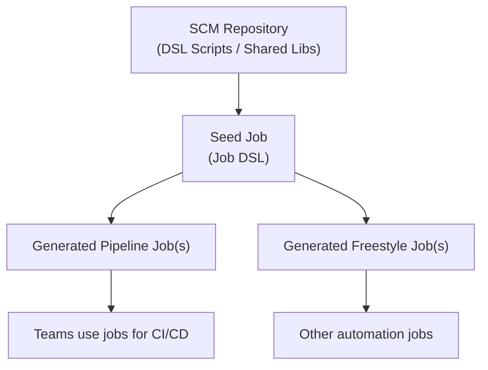

# **Documentation of Seed Job**

## Author Information

| Created by      | Created on         | Version          | Last updated On   | pre Reviewer       | L0 Reviewer     | L1 Reviewer          |    L2 Reviewer    |
|-----------------|--------------------|------------------|-------------------|--------------------|-----------------|----------------------|-------------------|
| Abhishek saini  |  03-10-2025        | V 1.0            |   03-10-2025     |  Prashant          |  Nikita     |     Rishab   |   Piyush |
---

## Table of Contents

- [What is a Seed Job?](#what-is-a-seed-job)
- [Why Seed Job](#why-seed-job) 
- [Purpose of the Seed Job](#purpose-of-the-seed-job)  
- [Required Configurations](#required-configurations)  
- [How the Seed Job Automates Job Creation](#how-the-seed-job-automates-job-creation)  
- [Steps to Maintain or Update Seed Job](#steps-to-maintain-or-update-seed-job)  
- [Workflow Diagram](#workflow-diagram)  

## What is a Seed Job?
A **Seed Job** in Jenkins is a special job responsible for creating and managing other Jenkins jobs automatically. It uses the **Job DSL plugin** or a **shared Jenkins library** to generate jobs dynamically, removing the need to manually create each pipeline or freestyle job.

---

## Why Seed Job?
- **Scalability**: Instead of manually creating dozens of Jenkins jobs, a seed job can generate them automatically from code.  
- **Consistency**: All jobs follow the same standards (naming, triggers, parameters, SCM, etc.).  
- **Version Control**: Job definitions are stored in Git, enabling history, rollback, and collaboration.  
- **Faster Onboarding**: New teams or projects can bootstrap jobs by just adding DSL scripts.  
- **Automation First**: Keeps Jenkins infrastructure as code, aligning with DevOps and GitOps practices.  
- **Easier Maintenance**: Updating one DSL script can update hundreds of jobs in one run.  

---

## Purpose of the Seed Job
- Centralizes job creation and configuration management.  
- Ensures consistency across multiple Jenkins jobs.  
- Reduces human error by automating repetitive setup tasks.  
- Provides version-controlled job definitions (stored in Git or other SCM).  
- Enables fast rollout of new jobs by simply updating the DSL script or shared library.

---
## Required Configurations

| Configuration Type      | Description                                                                                  |  Examples                          |
|-------------------------|----------------------------------------------------------------------------------------------|-------------------------------------------|
| **Plugins**             | Jenkins plugins required for seed job functionality                                          | Job DSL Plugin, Pipeline Plugin, Git Plugin |
| **Source Control**      | Repository storing DSL scripts or shared library code                                        | GitHub, GitLab, Bitbucket                  |
| **Job DSL Script**      | Defines how jobs should be created (naming conventions, triggers, SCM, parameters, etc.)   | `.groovy` files stored in SCM              |
| **Security & Access**   | Permissions and access control to prevent unauthorized modifications                        | Admins/DevOps only                         |
| **Execution Agent**     | Jenkins node/agent where seed job runs; must have access to required tools                   | Git, build tools, artifact repositories   |

---

## How the Seed Job Automates Job Creation
- Seed job fetches DSL scripts or shared library code from SCM.
- Jenkins Job DSL plugin parses the DSL script.
- DSL instructions create/update Jenkins jobs automatically.
- New jobs appear in Jenkins UI, ready for use.
- Updates to the DSL scripts in SCM can be reapplied via rerunning the seed job.  

---

## Steps to Maintain or Update Seed Job

| Step                     | Description                                                                                   | Notes / Best Practices                            |
|--------------------------|-----------------------------------------------------------------------------------------------|--------------------------------------------------|
| **Version Control**       | Update DSL scripts or shared library via Git commits                                         | Always commit with descriptive messages         |
| **Testing Changes**       | Validate scripts locally or in a non-prod Jenkins environment                                | Helps catch errors before affecting production  |
| **Updating Jobs**         | Modify DSL or shared library code, then rerun the seed job                                    | Rerunning updates existing jobs automatically  |
| **Monitoring**            | Check seed job build logs for errors or warnings                                             | Ensures job creation is successful              |
| **Documentation**         | Maintain a changelog of updates and modifications                                           | Useful for audits and onboarding new team members |

---

## Workflow Diagram

---

## Contact Information

| **Name**           | **Email address**                         |
|--------------------|--------------------------------------------|
| Abhishek saini    | abhishek.saini.snaatak@mygurukulam.co |

---

##  References 

| **Title**                                         | **URL**                                                                                             |
|---------------------------------------------------|-----------------------------------------------------------------------------------------------------|
| **How To Automate Jenkins Job Configuration Using Job DSL** | [Read More](https://www.digitalocean.com/community/tutorials/how-to-automate-jenkins-job-configuration-using-job-dsl) |
| **Sample Seed Repository for Jenkins Jobs**       | [View Repository](https://github.com/stelligent/jenkins-seed)                                       |
| **Automated Seed Job with Generated Pipeline in Jenkins** | [Read Article](https://medium.com/@dev0611ganindu/automated-seed-job-with-generated-pipeline-in-jenkins-1add4665c458) |

---
